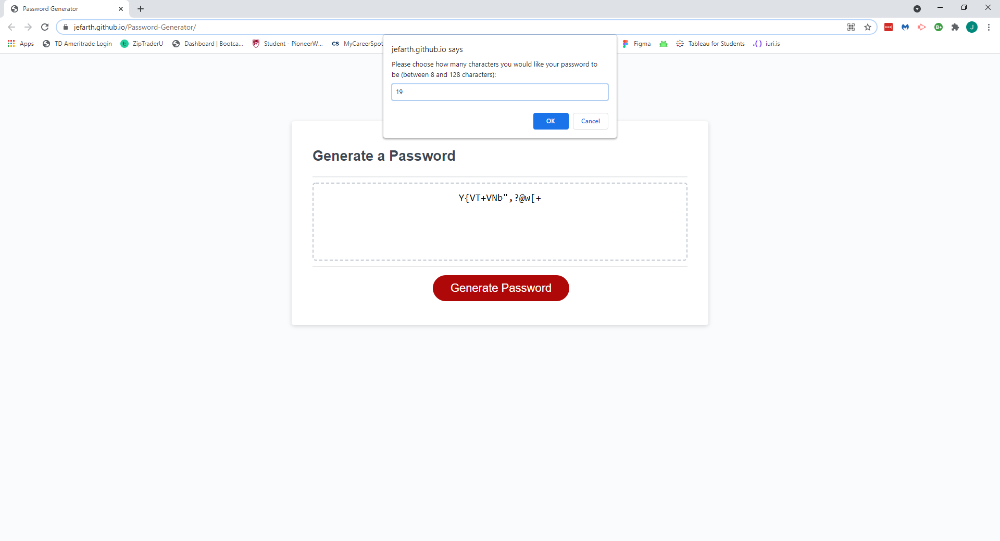

# Password Generator
  

  

  ## Description
This application allows a user to create a new secure password. When working with sensitive data a user can use this application to generate a random password with specific criteria.

## Table of Contents 

* [Installation](#installation)
* [Usage](#usage)
* [License](#license)
* [Contributing](#contributing)
* [Tests](#tests)
* [Questions](#questions)

## Installation
The following necessary dependencies must be installed to run the application properly: To install this project you must create an empty repository on your local machine first. After that copy the SSH key under the "code" tab and open a terminal on your new repository. Use the "git clone" prompt to clone the repository to your local repository.

## Usage
To use this application: This application can be accessed at a live site here: [Live Password Generator](https://jefarth.github.io/Password-Generator/) 

## License
This project is licensed under the MIT License.

## Contributing
Contributing: I wrote all of the javascript to make the app function.

## Tests
To run tests, you need to run the following command: Reloading the browser to check for errors.

## Questions
If you have any questions about the repo, please contact "jefarth" directly at jefarth.dev@gmail.com.

